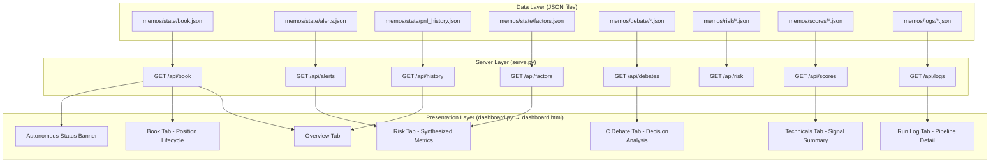

# Design Document: Dashboard Autonomous Revamp

## Overview

This design revamps the Jimothy Capital dashboard to surface autonomous trading mode data in an actionable, synthesized format. The current dashboard architecture — a single-page HTML app generated by `dashboard.py` and served by `serve.py` via Flask — remains the delivery mechanism. The revamp adds new display panels, KPI computation logic, and restructured tab content to reflect the autonomous lifecycle fields now present in book.json positions (trim_status, trail_stop_level, thesis_status, sigma events).

### Key Design Decisions

1. **Keep the single-file HTML architecture** — `dashboard.py` continues to emit a self-contained HTML file with embedded CSS/JS. This preserves the Cloudflare Tunnel deployment model (no static asset serving needed).
2. **Client-side rendering from API data** — All new panels fetch from existing `/api/*` endpoints. New data fields are surfaced by extending the existing API responses rather than creating new endpoints, with one exception for the alerts endpoint.
3. **Extend, don't replace, existing tabs** — New autonomous-mode panels augment the existing Book, Risk, Technicals, and Logs tabs rather than replacing them wholesale. This reduces risk of regression.
4. **Computation in JavaScript** — KPI metrics (exposure, trim aggregation, stop proximity) are computed client-side from the `/api/book` response. This avoids adding Python computation that would slow the API.

## Architecture



### Data Flow

1. **On page load**: All API endpoints are fetched concurrently. Embedded fallback data (from generation time) is used if API is unreachable.
2. **Every 30 seconds**: The refresh loop re-fetches all endpoints and re-renders panels.
3. **Client-side compute**: After each fetch, JavaScript functions compute derived metrics (KPIs, aggregations, traffic-light statuses) before rendering.

## Components and Interfaces

### 1. Server-Side Changes (serve.py)

#### Extended `/api/book` Response

No schema changes needed — the existing book.json already contains `trim_status`, `trail_stop_level`, `thesis_status` fields on positions. The `sigma_events` field needs to be computed and injected by the monitor at mark-to-market time or fetched from alerts.

#### New: `/api/alerts` Enhancement

Extend the existing alerts endpoint to also read from `memos/state/alerts.json` (the monitor output file) alongside the log-based alerts currently returned:

```python
@app.route("/api/alerts")
def api_alerts():
    # Existing log-based alerts
    ...
    # Add monitor alerts from alerts.json
    if ALERTS_PATH.exists():
        monitor_alerts = json.loads(ALERTS_PATH.read_text())
        # Merge into response
    return jsonify({"alerts": alerts, "monitor_alerts": monitor_alerts, "health": health})
```

### 2. Client-Side Components (dashboard.py JS generation)

#### 2.1 Autonomous Status Banner

A persistent top-bar component displaying:
- Circuit breaker state (active/inactive) with drawdown %
- Last pipeline cycle timestamp
- Overlap guard "Cycle Skipped" indicator
- Lifetime auto-booked trade count / session count

Data source: `/api/book` (for circuit breaker state from `session_open_nav` and current NAV) and `/api/logs` (for cycle timestamps and counts).

#### 2.2 Book Tab — Position Lifecycle Panel

Each position row gains:
- **Trim status badge**: Color-coded ("untrimmed" = grey, "half_trimmed" = amber, "fully_exited" = green)
- **Trail stop column**: Shows trail_stop_level price + percentage distance from current_price
- **Thesis status indicator**: Warning highlight when "review_overdue" with computed days overdue
- **Sigma event badge**: Shows magnitude vs threshold when a sigma event has been detected

KPI strip above the position table:
- Active position count
- Positions trimmed (half_trimmed count)
- Thesis overdue count
- Trail stop proximity (positions within 1% of stop)
- Gross/Net exposure
- Average pair P&L
- Capital freed by trims

#### 2.3 Risk Tab — Synthesized Dashboard

Replaces raw risk data dump with:
- **Alert summary bar**: Grouped by severity (critical/warning/info) with counts
- **Critical alert cards**: Prominent red-styled cards with recommended actions
- **Risk heatmap grid**: Drawdown from peak, gross leverage, net exposure, largest concentration, sector violations — each cell color-coded (green/amber/red)
- **Factor exposure traffic lights**: Grid showing each factor beta with color coding (green < 0.4, amber 0.4–0.6, red ≥ 0.6)
- **Correlation alerts**: Positions with correlation > 0.5 displayed as warning pairs
- **Trailing volatility**: 20-day vol for each position (computed from price_history)

Data sources: `/api/alerts`, `/api/factors`, `/api/book` (position price_history for volatility).

#### 2.4 IC Debate Tab — Decision Analysis

Structured cards replacing raw JSON dump:
- **Summary card per proposal**: Final conviction, rounds count, majority stance, outcome
- **Conviction distribution visual**: Bar/spark showing conviction trajectory across rounds
- **Link to Book position**: For booked trades, clickable link scrolls to Book tab position
- **Expandable argument history**: Full debate transcript per card
- **Agent conviction trajectory**: Initial → final conviction per agent

Data source: `/api/debates`.

#### 2.5 Technicals Tab — Signal Summary

Ranked table with:
- Composite score (sorted descending)
- Ticker, score, trend direction, momentum classification
- P&L annotation for positions also in Book
- "Weakening Technical" flag for scores < 40 on active positions
- Sector grouping with sector-average scores

Data sources: `/api/scores`, `/api/book`.

#### 2.6 Run Log Tab — Pipeline Execution Detail

- Cycle cards showing: timestamp, proposals evaluated, orders passed/rejected with failing gate
- Per-order breakdown: ticker, conviction, risk decision, PM execute, gate result
- Circuit breaker held orders flagged with drawdown %
- Last 20 cycles by default with "Load More" pagination

Data source: `/api/logs`.

#### 2.7 Overview Tab — Autonomous Summary

- NAV, total P&L ($/%/), gross/net exposure, cash %, active positions, at-risk positions
- Trims Today count + capital freed
- Equity curve with drawdown overlay + circuit breaker activation markers
- Alert count badge with highest-severity message

Data sources: `/api/book`, `/api/history`, `/api/alerts`.

### 3. Computation Functions (Client-Side JS)

These pure functions compute derived metrics from API data:

```javascript
// KPI computations
function computeGrossExposure(positions) { ... }
function computeNetExposure(positions) { ... }
function computeAveragePairPnL(positions) { ... }
function computeCapitalFreedByTrims(positions, nav) { ... }
function computeTrailStopProximity(position) { ... }
function computeTrailing20dVol(priceHistory) { ... }
function computeDrawdownFromPeak(navHistory) { ... }

// Classification/formatting
function classifyFactorBeta(beta) { ... }  // returns "green"|"amber"|"red"
function formatTrimBadge(trimStatus) { ... }
function computeDaysOverdue(thesisStatus, lastReviewDate) { ... }
function computeConvictionTrajectory(debate) { ... }
```

## Data Models

### Position Object (from /api/book → positions[])

```typescript
interface Position {
  ticker: string;
  hedge_ticker: string;
  direction: "long" | "short";
  status: "active" | "closed";
  entry_price: number;
  current_price: number;
  hedge_entry_price: number;
  hedge_current_price: number;
  size_pct_nav: number;
  combined_pnl_pct: number | null;
  unrealized_pnl_pct: number | null;
  daily_change_pct: number;
  price_history: PriceHistoryEntry[];
  
  // Autonomous lifecycle fields
  trim_status: "untrimmed" | "half_trimmed" | "fully_exited";
  trail_stop_level: number | null;
  thesis_status: "active" | "review_overdue";
  proposal_id: string;
  entry_date: string;
}

interface PriceHistoryEntry {
  date: string;
  price: number;
  hedge_price: number | null;
  combined_pnl_pct: number | null;
  daily_change_pct: number;
}
```

### Alert Object (from /api/alerts → monitor_alerts[])

```typescript
interface Alert {
  level: "critical" | "warning" | "info";
  category: "stop" | "drawdown" | "factor" | "correlation" | "holding" | "sigma";
  ticker: string;
  message: string;
  action: string;
  timestamp: string;
}
```

### Debate Object (from /api/debates → debates[])

```typescript
interface Debate {
  proposal_id: string;
  ticker: string;
  rounds: DebateRound[];
  final_conviction: number;
  outcome: "booked" | "rejected" | "pending";
}

interface DebateRound {
  round: number;
  arguments: DebateArgument[];
}

interface DebateArgument {
  agent: string;
  stance: "support" | "challenge";
  argument: string;
  conviction: number;
  revised_conviction?: number;
}
```

### Cycle Log Object (from /api/logs)

```typescript
interface CycleLog {
  timestamp: string;
  cycle_type: string;
  proposals_evaluated?: number;
  orders: OrderResult[];
  circuit_breaker_active?: boolean;
  drawdown_at_time?: number;
}

interface OrderResult {
  ticker: string;
  conviction: number;
  risk_decision: string;
  pm_execute: boolean;
  gate_result: "passed" | "failed";
  failing_gate?: "conviction" | "risk" | "pm_execute" | "circuit_breaker";
}
```

### Technical Score Object (from /api/scores)

```typescript
interface TechnicalScore {
  ticker: string;
  composite_score: number;
  trend_direction: "up" | "down" | "sideways";
  momentum: "strong" | "moderate" | "weak";
  sector?: string;
  timestamp: string;
}
```

## Correctness Properties

*A property is a characteristic or behavior that should hold true across all valid executions of a system — essentially, a formal statement about what the system should do. Properties serve as the bridge between human-readable specifications and machine-verifiable correctness guarantees.*

While this feature is primarily UI rendering (generating HTML from JSON), the **client-side computation functions** that derive KPIs and classify data are pure functions suitable for property-based testing. The rendering/display aspects are best validated with example-based tests and visual regression.

### Property 1: Gross exposure is the sum of absolute position sizes

*For any* set of active positions with `size_pct_nav` values, `computeGrossExposure(positions)` SHALL equal the sum of absolute values of all `size_pct_nav` fields.

**Validates: Requirements 2.2**

### Property 2: Net exposure is the signed sum of position sizes

*For any* set of active positions with `size_pct_nav` and `direction` fields, `computeNetExposure(positions)` SHALL equal the sum of `size_pct_nav` (positive for long, negative for short).

**Validates: Requirements 2.2**

### Property 3: Trail stop proximity percentage is consistent with price data

*For any* position with a `trail_stop_level` and `current_price`, the computed trail stop proximity percentage SHALL equal `(current_price - trail_stop_level) / current_price` for long positions and `(trail_stop_level - current_price) / current_price` for short positions.

**Validates: Requirements 1.2**

### Property 4: Factor beta classification respects threshold ordering

*For any* numeric beta value, `classifyFactorBeta(beta)` SHALL return "green" when `|beta| < 0.4`, "amber" when `0.4 ≤ |beta| < 0.6`, and "red" when `|beta| ≥ 0.6`. The classification SHALL be monotonically non-decreasing in severity as `|beta|` increases.

**Validates: Requirements 3.4**

### Property 5: Capital freed by trims aggregation is non-negative

*For any* set of positions where some have `trim_status` of "half_trimmed", `computeCapitalFreedByTrims(positions, nav)` SHALL return a non-negative value representing the sum of freed capital from all trimmed positions.

**Validates: Requirements 2.3**

### Property 6: Alert grouping counts sum to total alerts

*For any* list of alerts, the sum of alerts grouped by severity (critical + warning + info) SHALL equal the total number of alerts in the input list.

**Validates: Requirements 3.1**

### Property 7: Trailing 20-day volatility computation matches stddev definition

*For any* price history with at least 2 entries, `computeTrailing20dVol(priceHistory)` SHALL return the sample standard deviation (Bessel's correction, n-1 denominator) of the last 20 `daily_change_pct` values, matching the Python `sigma_detector.compute_trailing_stddev` output.

**Validates: Requirements 3.6**

### Property 8: Conviction trajectory preserves round ordering

*For any* debate with multiple rounds, `computeConvictionTrajectory(debate)` SHALL return conviction values in the same temporal order as the debate rounds (sorted by round number), with the first element being the initial conviction and the last being the final.

**Validates: Requirements 4.5**

## Error Handling

### Missing/Null Fields

- Position fields (`trim_status`, `trail_stop_level`, `thesis_status`) may be absent on older positions. The UI treats missing `trim_status` as "untrimmed", missing `trail_stop_level` as "not set" (hide the column value), and missing `thesis_status` as "active".
- If `price_history` is empty or has fewer than 2 entries, volatility displays "N/A" rather than computing.

### API Failures

- If any API endpoint returns a non-200 response or times out, the dashboard falls back to the embedded static data from generation time. A small "Stale data" indicator appears in the status banner.
- The 30-second refresh loop continues attempting fetches on failure rather than stopping.

### Data Staleness

- The `/api/book` response includes `_stale` and `_last_poll_age_minutes`. When `_stale` is true, the Book tab header shows an amber "Data stale — last poll {N} min ago" badge.
- Circuit breaker state computed from stale data displays a "Last known" qualifier.

### Edge Cases

- Zero positions: KPI strip shows all zeroes; position table shows "No active positions" placeholder.
- Circuit breaker with no `session_open_nav`: Display "CB state unknown" rather than computing from invalid data.
- Debates with no rounds: Show the proposal card with "No debate recorded" message.
- Scores without matching positions: Display score in Technicals tab without P&L annotation.

## Testing Strategy

### Unit Tests (Example-Based)

- **Rendering tests**: Verify that each tab's render function produces expected HTML structure given sample JSON input (snapshot-style assertions on key elements).
- **Edge case tests**: Empty positions array, null fields, missing price_history, zero NAV.
- **Integration point tests**: Verify the `/api/alerts` endpoint correctly merges log-based and monitor-based alerts.
- **Classification tests**: Specific examples for factor beta at exact boundaries (0.39, 0.4, 0.59, 0.6).

### Property-Based Tests (Hypothesis — Python for computation functions)

The client-side JS computation functions have direct Python equivalents used in tests. Each property test runs **minimum 100 iterations** with randomized inputs.

- **Library**: Hypothesis (Python) for server-side equivalents; fast-check (JS) for client-side if testing JS directly.
- **Tag format**: `Feature: dashboard-autonomous-revamp, Property {N}: {title}`
- Each correctness property above maps to exactly one property-based test.

### Visual/Manual Tests

- Cross-browser rendering verification (Chrome, Firefox, Safari)
- Responsive layout at common breakpoints
- Color contrast verification for accessibility on all badge colors
- Dark theme readability of all new panels

### Integration Tests

- Full page load with serve.py running and sample data in place
- Verify all API endpoints return valid JSON matching expected schema
- Verify 30-second refresh cycle updates panels without page reload
