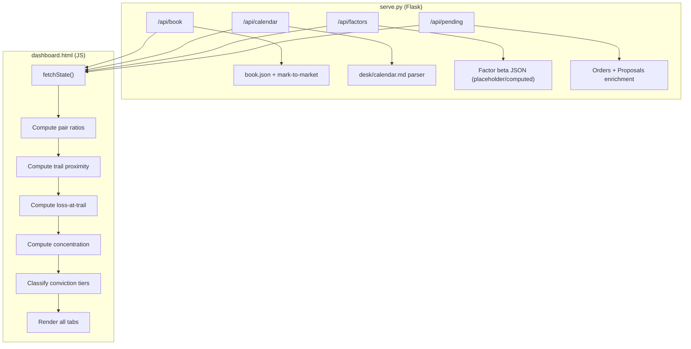

# Design Document: Dashboard Bootstrap Alignment

## Overview

This design aligns the portfolio dashboard (`dashboard.py` → `dashboard.html`) with the operational framework defined in the bootstrap specification files. The implementation adds 10 enhancements to the existing single-page dashboard architecture: pair-ratio position display, trail/target proximity indicators, factor beta exposure table, leverage regime badge, flip-condition display, full pitch format for pending orders, loss-at-trail KPIs, conviction tier tagging, desk calendar integration, and concentration limits display.

The existing architecture is preserved: `dashboard.py` generates a self-contained HTML file with embedded CSS and JavaScript, served by `serve.py` (Flask). The dashboard fetches live data from JSON API endpoints. All new rendering logic lives in the client-side JavaScript; only 2-3 new API endpoints are added to `serve.py`.

### Design Decisions

1. **Client-side computation over server-side** — Pair ratios, trail proximity, loss-at-trail, and concentration can all be computed from existing `book.json` fields. This avoids backend changes and keeps the dashboard usable as a static file.
2. **New endpoints only for data not in book.json** — Calendar (parsed from markdown) and factor betas (computed externally) require new endpoints.
3. **Progressive enhancement** — Every new widget degrades gracefully with "—" or "pending" labels when data is unavailable, per requirements.
4. **Sector inference from hedge_ticker** — The hedge ETF uniquely identifies the GICS sector (RSPG→Energy, RSPC→Communication Services, etc.), eliminating the need for a separate sector lookup.

## Architecture



### Data Flow

1. On load and on refresh, the dashboard JS fetches `/api/book`, `/api/pending`, `/api/calendar`, `/api/factors`, and `/api/history`.
2. A pure computation layer transforms raw position data into derived metrics (ratios, distances, classifications).
3. The render layer reads computed state and produces DOM updates, applying color/highlight rules.

## Components and Interfaces

### Backend Components

#### 1. Calendar API Endpoint (`/api/calendar`)

**Location:** `serve.py`

```python
@app.route("/api/calendar")
def api_calendar():
    """Parse desk/calendar.md and return structured JSON."""
    # Returns: { "macro": [...], "cb": [...], "earnings": [...], "holidays": [...], "empty": bool }
```

**Parser logic:**
- Reads `desk/calendar.md`
- Splits by `###` section headers (Macro releases, CB decisions, Earnings, Holidays)
- Within each section, parses markdown table rows
- If all rows are `| — |` or empty, sets `"empty": true`
- Returns structured arrays per event type

**Calendar event schema:**
```json
{
  "macro": [{ "day": "Mon", "time": "08:30", "currency": "USD", "release": "GDP Q2", "consensus": "2.1%", "seat": "macro_northamerica" }],
  "cb": [{ "date": "2026-07-30", "currency": "JPY", "action": "hold expected" }],
  "earnings": [{ "date": "2026-07-29", "timing": "AMC", "ticker": "AAPL", "seat": "fund_infotech" }],
  "holidays": [{ "date": "2026-09-01", "name": "Labor Day", "type": "full" }],
  "empty": false
}
```

#### 2. Factor Beta Endpoint (`/api/factors`)

**Location:** `serve.py`

```python
@app.route("/api/factors")
def api_factors():
    """Return book-level factor betas. Reads from memos/state/factors.json if available."""
    # Returns: { "factors": { "USD_DXY": 0.12, "SPX": -0.05, ... }, "computed_at": "...", "available": bool }
```

**Behavior:**
- Reads `memos/state/factors.json` if it exists (produced by a future factor computation script)
- If the file doesn't exist, returns `{ "available": false, "factors": {} }`
- The 9 factor keys: `USD_DXY`, `SPX`, `RATES_10Y`, `VIX`, `GROWTH_VALUE`, `CRUDE_CL1`, `LARGE_SMALL`, `HY_CREDIT`, `GOLD_XAU`

#### 3. Leverage Regime in Book Response

**Location:** `serve.py` — modify `api_book()`

Add a `leverage_regime` field to the book response by reading the latest risk assessment:
```python
# In api_book(), after mark_positions_to_market:
book["leverage_regime"] = get_latest_leverage_regime()  # reads latest risk/*.json for "leverage_regime" field
```

### Frontend Components (JavaScript in `dashboard.py`)

#### 4. Computation Module — `computeDerivedMetrics(state)`

A pure function that takes the raw API state and returns enriched position objects:

```javascript
function computeDerivedMetrics(state) {
  const positions = state.book.positions.filter(p => p.status === 'active').map(pos => {
    const entryRatio = round4(pos.entry_price / pos.hedge_entry_price);
    const currentRatio = round4(pos.current_price / pos.hedge_current_price);
    const peakRatio = pos.peak_ratio || entryRatio;
    const pnlPct = (currentRatio - entryRatio) / entryRatio * 100;
    const distFromPeak = (peakRatio - currentRatio) / peakRatio * 100;
    const targetRatio = entryRatio * 1.05;
    const distToTarget = (targetRatio - currentRatio) / currentRatio * 100;
    const trailPct = parseTrailPct(pos.stop_loss_method); // extracts numeric % from "trailing 2.5% from peak"
    const lossAtTrail = trailPct !== null ? Math.round(trailPct / 100 * pos.size_pct_nav * 10000) : null;
    const highlight = classifyProximity(distFromPeak, trailPct);
    const isHighConviction = pos.size_pct_nav > 0.05;
    
    return { ...pos, entryRatio, currentRatio, peakRatio, pnlPct, distFromPeak, distToTarget, trailPct, lossAtTrail, highlight, isHighConviction };
  });
  
  const totalLossAtTrail = positions.reduce((sum, p) => sum + (p.lossAtTrail || 0), 0);
  const concentration = computeConcentration(positions);
  
  return { positions, totalLossAtTrail, concentration };
}
```

#### 5. Sector Mapping — `HEDGE_TO_SECTOR`

```javascript
const HEDGE_TO_SECTOR = {
  'RSPG': 'Energy', 'RSPM': 'Materials', 'RSPN': 'Industrials',
  'RSPD': 'Consumer Discretionary', 'RSPS': 'Consumer Staples',
  'RSPH': 'Health Care', 'RSPF': 'Financials', 'RSPT': 'Information Technology',
  'RSPC': 'Communication Services', 'RSPU': 'Utilities', 'RSPR': 'Real Estate'
};
```

#### 6. Concentration Computation — `computeConcentration(positions)`

```javascript
function computeConcentration(positions) {
  const sectors = {};
  for (const pos of positions) {
    const sector = HEDGE_TO_SECTOR[pos.hedge_ticker] || 'Unknown';
    if (!sectors[sector]) sectors[sector] = { count: 0, navPct: 0 };
    sectors[sector].count += 1;
    sectors[sector].navPct += pos.size_pct_nav;
  }
  // Classify each sector
  for (const [name, data] of Object.entries(sectors)) {
    data.highlight = data.count >= 4 ? 'red' : (data.count >= 3 || data.navPct > 0.12) ? 'amber' : 'normal';
  }
  return sectors;
}
```

#### 7. Trail Proximity Classification — `classifyProximity(distFromPeak, trailPct)`

```javascript
function classifyProximity(distFromPeak, trailPct) {
  if (trailPct === null) return 'normal';
  const gap = trailPct - distFromPeak; // how far from triggering
  if (gap <= 0.5) return 'red';
  if (gap <= 1.0) return 'amber';
  return 'normal';
}
```

#### 8. Factor Beta Classification — `classifyBeta(beta)`

```javascript
function classifyBeta(beta) {
  const abs = Math.abs(beta);
  if (abs > 0.6) return 'red';
  if (abs > 0.4) return 'amber';
  return 'normal';
}
```

#### 9. Leverage Regime Color — `regimeColor(regime)`

```javascript
function regimeColor(regime) {
  switch (regime) {
    case 'LEAN-IN': return 'green';
    case 'NEUTRAL': return 'gray';
    case 'CUT': return 'red';
    default: return 'gray';
  }
}
```

#### 10. Pitch Renderer — `renderPendingOrder(order)`

Renders a pending order in the canonical telegram format:
- Thesis (from `order._proposal.thesis` or `order._proposal.portfolio_thesis`)
- Counter-argument (from `order._proposal.best_counter`)
- Entry/Stop/Target levels
- Size + Loss-at-trail
- Technical score (from `order._tech_score`)
- Risk verdict (from `order._risk.decision`)
- Factor deltas filtered to |delta| > 0.1

Falls back to "—" for any missing field.

#### 11. Calendar Widget — `renderCalendar(calendarData)`

Renders the compact calendar widget (Overview tab) and full calendar section (Calendar tab):
- If `calendarData.empty === true`, displays "No calendar data available"
- Otherwise renders tables grouped by event type

#### 12. Flip Condition Display

In the expanded position detail view, displays:
- `order._proposal.flip_condition` if available
- "Not specified" if the field is missing

### UI Layout Changes

| Tab | New Widgets Added |
|---|---|
| Overview | Leverage regime badge, Total loss-at-trail KPI, Factor warnings (>0.4), Calendar compact widget |
| Positions | Pair ratio columns (entry/current/peak), P&L from ratio, Trail %, Distance from peak, Distance to target, Loss-at-trail (bps), Conviction badge, Amber/red row highlights |
| Positions (expanded) | Flip condition field, Conviction memo |
| Pending | Full pitch format (thesis, counter, entry/stop/target, size, tech, risk, factors) |
| Risk | Factor beta table (9 rows), Concentration table (sector + country) |
| Calendar (new tab) | Full calendar by category |

## Data Models

### Enriched Position (client-side computed)

```typescript
interface EnrichedPosition {
  // Existing fields from book.json
  ticker: string;
  direction: 'long' | 'short';
  hedge_ticker: string;
  hedge_direction: 'long' | 'short';
  entry_price: number;
  hedge_entry_price: number;
  current_price: number;
  hedge_current_price: number;
  size_pct_nav: number;
  conviction: number;
  stop_loss_method: string;
  status: string;
  proposal_id: string;
  
  // Computed fields
  entryRatio: number;       // entry_price / hedge_entry_price, 4dp
  currentRatio: number;     // current_price / hedge_current_price, 4dp
  peakRatio: number;        // max ratio since entry (long) or min (short)
  pnlPct: number;           // (currentRatio - entryRatio) / entryRatio * 100
  distFromPeak: number;     // (peakRatio - currentRatio) / peakRatio * 100
  distToTarget: number;     // (targetRatio - currentRatio) / currentRatio * 100
  trailPct: number | null;  // parsed from stop_loss_method
  lossAtTrail: number | null; // trailPct/100 * size_pct_nav * 10000, rounded
  highlight: 'red' | 'amber' | 'normal';
  isHighConviction: boolean; // size_pct_nav > 0.05
  sector: string;           // derived from hedge_ticker via HEDGE_TO_SECTOR
}
```

### Factor Beta Response

```typescript
interface FactorBetaResponse {
  available: boolean;
  computed_at: string | null;
  factors: {
    USD_DXY: number;
    SPX: number;
    RATES_10Y: number;
    VIX: number;
    GROWTH_VALUE: number;
    CRUDE_CL1: number;
    LARGE_SMALL: number;
    HY_CREDIT: number;
    GOLD_XAU: number;
  };
}
```

### Calendar Response

```typescript
interface CalendarResponse {
  empty: boolean;
  macro: Array<{ day: string; time: string; currency: string; release: string; consensus: string; seat: string }>;
  cb: Array<{ date: string; currency: string; action: string }>;
  earnings: Array<{ date: string; timing: 'BMO' | 'AMC'; ticker: string; seat: string }>;
  holidays: Array<{ date: string; name: string; type: 'full' | 'early' }>;
}
```

### Concentration Data (client-side computed)

```typescript
interface ConcentrationEntry {
  sector: string;
  count: number;         // positions in this sector
  maxCount: 4;           // hard limit
  navPct: number;        // sum of size_pct_nav for this sector
  maxNavPct: 0.15;       // 15% hard limit
  highlight: 'red' | 'amber' | 'normal';
}
```

## Correctness Properties

*A property is a characteristic or behavior that should hold true across all valid executions of a system — essentially, a formal statement about what the system should do. Properties serve as the bridge between human-readable specifications and machine-verifiable correctness guarantees.*

### Property 1: Ratio computation correctness

*For any* two positive numbers (entry_price, hedge_entry_price), the computed ratio SHALL equal `Math.round(entry_price / hedge_entry_price * 10000) / 10000`, and this applies identically to current prices.

**Validates: Requirements 1.1, 1.2**

### Property 2: P&L derived from ratios, not legs

*For any* valid position with entry_price, hedge_entry_price, current_price, and hedge_current_price, the computed P&L SHALL equal `(currentRatio - entryRatio) / entryRatio * 100` where the ratios are the 4dp-rounded divisions, and SHALL NOT equal the average of individual leg P&Ls (except by coincidence).

**Validates: Requirements 1.4**

### Property 3: Peak ratio is monotonic for longs

*For any* sequence of ratio observations for a long position, the peak ratio after N observations SHALL be greater than or equal to the peak ratio after N-1 observations (i.e., peak never decreases for longs, never increases for shorts).

**Validates: Requirements 1.3**

### Property 4: Distance-from-peak computation

*For any* peak_ratio > 0 and current_ratio > 0 where current_ratio <= peak_ratio (long position), the distance from peak SHALL equal `(peak_ratio - current_ratio) / peak_ratio * 100` and SHALL be non-negative.

**Validates: Requirements 2.2**

### Property 5: Distance-to-target computation

*For any* entry_ratio > 0 and current_ratio > 0, the distance to target SHALL equal `(entry_ratio * 1.05 - current_ratio) / current_ratio * 100`.

**Validates: Requirements 2.3**

### Property 6: Trail proximity classification is exhaustive and mutually exclusive

*For any* distance_from_peak >= 0 and trail_pct > 0, exactly one of these holds: (a) `trail_pct - distance_from_peak <= 0.5` → red, (b) `0.5 < trail_pct - distance_from_peak <= 1.0` → amber, (c) `trail_pct - distance_from_peak > 1.0` → normal.

**Validates: Requirements 2.4, 2.5**

### Property 7: Factor beta classification is exhaustive and mutually exclusive

*For any* numeric beta value, exactly one of these holds: (a) `|beta| > 0.6` → red, (b) `0.4 < |beta| <= 0.6` → amber, (c) `|beta| <= 0.4` → normal. The Overview tab summary SHALL contain exactly those factors classified as amber or red.

**Validates: Requirements 3.3, 3.4, 3.6**

### Property 8: Leverage regime color mapping is total

*For any* string value of leverage_regime, the color mapping SHALL produce: "LEAN-IN" → green, "NEUTRAL" → gray, "CUT" → red, any other value → gray.

**Validates: Requirements 4.2, 4.3, 4.4**

### Property 9: Loss-at-trail computation

*For any* trail_pct in [2, 3] and size_pct_nav in (0, 0.08], the computed loss-at-trail SHALL equal `Math.round(trail_pct / 100 * size_pct_nav * 10000)` and SHALL be a non-negative integer.

**Validates: Requirements 7.1**

### Property 10: Total loss-at-trail is the sum of individual positions

*For any* list of positions each having a non-null lossAtTrail value, the total loss-at-trail SHALL equal the sum of all individual lossAtTrail values.

**Validates: Requirements 7.2**

### Property 11: Conviction tier classification threshold

*For any* position, the isHighConviction flag SHALL be true if and only if `size_pct_nav > 0.05`.

**Validates: Requirements 8.1, 8.3**

### Property 12: Factor delta filtering

*For any* set of factor deltas (name → value pairs), the filtered display set SHALL contain exactly those entries where `|value| > 0.1`.

**Validates: Requirements 6.7**

### Property 13: Concentration grouping correctness

*For any* set of active positions with valid hedge_tickers, grouping by HEDGE_TO_SECTOR SHALL produce sector entries where (a) count equals the number of positions with that sector's hedge_ticker, and (b) navPct equals the sum of size_pct_nav for those positions.

**Validates: Requirements 10.1, 10.2, 10.3, 10.6**

### Property 14: Concentration threshold classification

*For any* sector with count in [0, 30] and navPct in [0, 1.0], the highlight SHALL be: (a) red if count >= 4, (b) amber if count == 3 OR navPct > 0.12 (and count < 4), (c) normal otherwise.

**Validates: Requirements 10.4, 10.5**

### Property 15: Calendar event rendering completeness

*For any* calendar event of type "macro", the rendered output SHALL contain the date, time, currency, release name, and consensus fields. For type "cb", the rendered output SHALL contain date, currency, and action. For type "earnings", the rendered output SHALL contain date, ticker, and timing.

**Validates: Requirements 9.2, 9.3, 9.4**

## Error Handling

| Scenario | Behavior |
|---|---|
| `/api/calendar` — `desk/calendar.md` missing or unreadable | Return `{ "empty": true, "macro": [], "cb": [], "earnings": [], "holidays": [] }` |
| `/api/factors` — `memos/state/factors.json` missing | Return `{ "available": false, "factors": {} }` |
| `/api/book` — position missing `hedge_entry_price` | Set `entryRatio = null`, display "—" for all ratio-derived fields |
| Trail percentage unparseable from `stop_loss_method` | Set `trailPct = null`, `lossAtTrail = null`, display "—" |
| `hedge_ticker` not in HEDGE_TO_SECTOR map | Assign sector "Unknown", still include in concentration count |
| Proposal data missing for a pending order field | Display "—" per requirement 6.8 |
| Division by zero (hedge price = 0) | Guard with `if (denominator > 0)` check, display "—" otherwise |
| Calendar markdown has unexpected format | Return empty arrays for unparseable sections, set `empty = true` if all fail |

## Testing Strategy

### Property-Based Tests

The computation functions extracted into the JS module are pure and well-suited for property-based testing. Use **fast-check** (JavaScript PBT library) to validate all 15 correctness properties above.

**Configuration:**
- Minimum 100 iterations per property
- Each test tagged with: `// Feature: dashboard-bootstrap-alignment, Property N: <title>`

**Test file:** `tests/dashboard-computations.property.test.js`

The computation functions (`computeRatio`, `computePnlFromRatios`, `classifyProximity`, `classifyBeta`, `computeLossAtTrail`, `computeConcentration`, `classifyConcentration`, `regimeColor`, `filterFactorDeltas`, `peakRatioUpdate`) will be extracted into a standalone module (`src/dashboard/computations.js`) importable by both the test runner and the dashboard HTML generator.

### Unit Tests (Example-Based)

**Test file:** `tests/dashboard-computations.unit.test.js`

Cover specific examples and edge cases:
- Missing peak_ratio defaults to entry_ratio (Req 1.5)
- Factor table has exactly 9 rows (Req 3.1)
- Factor display shows "—" when unavailable (Req 3.7)
- Leverage regime "—" when unavailable (Req 4.5)
- Flip condition "Not specified" when missing (Req 5.3)
- Pitch fields show "—" when missing (Req 6.8)
- Loss-at-trail shows "—" when trail_pct is null (Req 7.3)
- Conviction memo "Memo not available" when missing (Req 8.4)
- Calendar shows "No calendar data available" for empty/placeholder content (Req 9.6)
- Country section shows "Country data pending" when unavailable (Req 10.7)

### Integration Tests

**Test file:** `tests/serve_api.test.py`

- `/api/calendar` returns valid JSON with expected schema
- `/api/factors` returns `available: false` when no factors.json exists
- `/api/book` response includes `leverage_regime` field
- `/api/pending` enriched response includes `_proposal` data

### Manual Verification

- Visual check of highlight colors (red/amber/gold) across themes
- Dashboard loads correctly as static file (no server) with embedded fallback data
- Responsive layout with 6+ positions in the table
