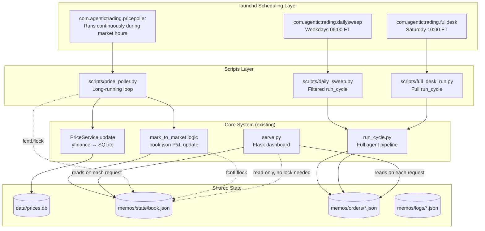
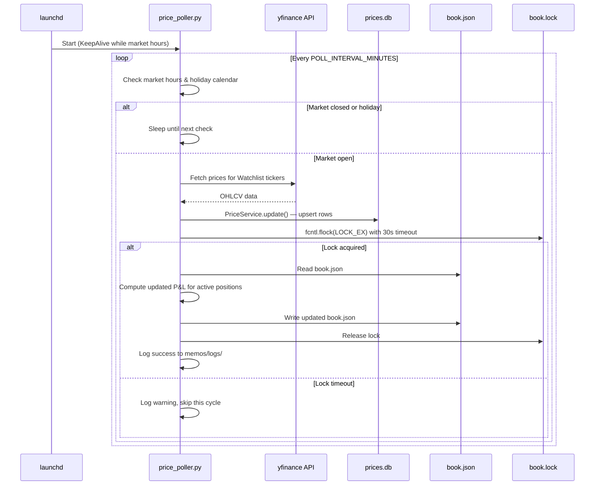
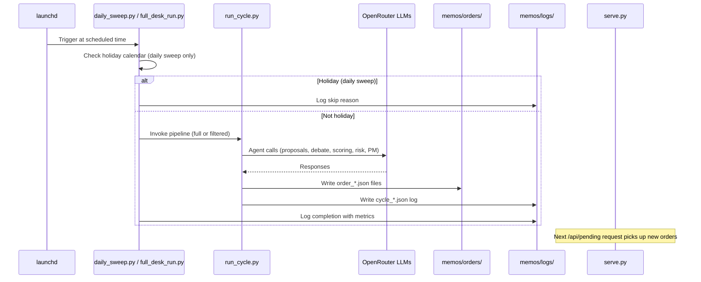

# Design Document: Live Data & Automated Recommendations

## Overview

This design converts the Agentic Trading Research system from a manually-invoked workflow into an always-on platform with two new subsystems:

1. **Price Poller** — A long-running Python process that fetches live prices from yfinance every 5 minutes during US market hours, updates the SQLite database, and marks positions to market.
2. **Pipeline Scheduler** — launchd plist configurations that trigger the agent pipeline on a Saturday full desk run (10:00 ET) and weekday daily sweeps (06:00 ET).

Both subsystems write to shared state files (`book.json`, `memos/orders/`) that the existing Flask dashboard (`serve.py`) already reads on each request. No changes to the dashboard's refresh mechanism are needed — it already polls `/api/book` every 30 seconds.

**Design Principles:**
- Minimal moving parts — simple Python scripts + launchd, no external job queues
- Reuse existing code paths (`PriceService.update()`, `mark_to_market.py` logic, `run_cycle.py` phases)
- File-level advisory locking (`fcntl.flock`) for concurrent access safety
- Graceful degradation — failures log and retry next interval, never crash the daemon

## Architecture



### Data Flow: Price Polling Cycle



### Data Flow: Pipeline Trigger (Daily Sweep / Full Desk)



## Components and Interfaces

### Component 1: Price Poller (`scripts/price_poller.py`)

**Responsibility:** Long-running process that polls yfinance during market hours and updates book.json.

**Interface:**
```python
# Environment variables
POLL_INTERVAL_MINUTES = int(os.environ.get("POLL_INTERVAL_MINUTES", "5"))
PRICE_POLLER_TICKERS = os.environ.get("PRICE_POLLER_TICKERS", "")  # comma-sep override, else POC_TICKERS

# Main loop pseudocode
def main():
    while True:
        if not is_market_open():
            sleep_until_next_market_open()
            continue
        try:
            tickers = get_ticker_list()
            price_service.update(tickers, lookback_days=2)
            with book_lock(timeout=30):
                mark_positions_to_market()
            log_cycle("price_poll", "success")
        except LockTimeout:
            log_cycle("price_poll", "skipped_lock")
        except Exception as e:
            log_cycle("price_poll", "error", str(e))
        sleep(POLL_INTERVAL_MINUTES * 60)
```

**Key decisions:**
- The poller runs as a simple `while True` loop, not a threaded scheduler. launchd manages its lifecycle.
- Uses `PriceService.update()` with `lookback_days=2` (only fetches today + yesterday to fill gaps).
- Mark-to-market logic is extracted from `mark_to_market.py` into a shared function in `src/data_platform/book_ops.py`.
- The poller does NOT restart `serve.py`. Flask reads `book.json` fresh on each `/api/book` request already.

### Component 2: Book Operations Module (`src/data_platform/book_ops.py`)

**Responsibility:** Shared lock-aware read/write of `book.json` and mark-to-market computation. Used by price_poller, mark_to_market.py, and serve.py.

**Interface:**
```python
import fcntl
from pathlib import Path
from contextlib import contextmanager

BOOK_PATH = Path(__file__).parent.parent.parent / "memos" / "state" / "book.json"
LOCK_PATH = BOOK_PATH.with_suffix(".lock")

class LockTimeout(Exception):
    pass

@contextmanager
def book_lock(timeout: int = 30):
    """Acquire an exclusive advisory lock on book.json.lock"""
    lock_fd = open(LOCK_PATH, "w")
    deadline = time.time() + timeout
    while True:
        try:
            fcntl.flock(lock_fd, fcntl.LOCK_EX | fcntl.LOCK_NB)
            try:
                yield lock_fd
            finally:
                fcntl.flock(lock_fd, fcntl.LOCK_UN)
                lock_fd.close()
            return
        except BlockingIOError:
            if time.time() >= deadline:
                lock_fd.close()
                raise LockTimeout(f"Could not acquire book lock within {timeout}s")
            time.sleep(0.5)

def load_book() -> dict:
    """Read book.json (caller should hold lock for writes)."""
    ...

def save_book(book: dict) -> None:
    """Atomic write: write to .tmp then rename."""
    ...

def mark_positions(book: dict, price_service: PriceService) -> dict:
    """Recompute P&L for all active positions using latest prices."""
    ...
```

**Key decisions:**
- Lock file is separate (`book.json.lock`) so reads don't block. `serve.py` reads without locking (acceptable for dashboard display — worst case shows slightly stale data for one refresh cycle).
- Write uses atomic rename (`write .tmp` then `os.replace`) to prevent partial reads.
- This module is extracted from the duplicate logic currently in both `mark_to_market.py` and `serve.py`.

### Component 3: Market Calendar (`src/data_platform/market_calendar.py`)

**Responsibility:** Determine whether the market is open right now, and provide the next open time.

**Interface:**
```python
from datetime import datetime, time
import pytz

ET = pytz.timezone("America/New_York")
MARKET_OPEN = time(9, 30)
MARKET_CLOSE = time(16, 0)

# Static holiday list — updated annually
US_MARKET_HOLIDAYS_2025 = [
    "2025-01-01", "2025-01-20", "2025-02-17", "2025-04-18",
    "2025-05-26", "2025-06-19", "2025-07-04", "2025-09-01",
    "2025-11-27", "2025-12-25",
]
US_MARKET_HOLIDAYS_2026 = [
    "2026-01-01", "2026-01-19", "2026-02-16", "2026-04-03",
    "2026-05-25", "2026-06-19", "2026-07-03", "2026-09-07",
    "2026-11-26", "2026-12-25",
]

def is_market_open(now: datetime | None = None) -> bool:
    """True if current time is within US equity market hours and not a holiday."""
    ...

def is_trading_day(dt: date | None = None) -> bool:
    """True if the given date is a weekday and not a US market holiday."""
    ...

def next_market_open(now: datetime | None = None) -> datetime:
    """Return the next datetime when market opens (for sleep calculations)."""
    ...
```

**Key decisions:**
- Static holiday list in code rather than parsing `desk/calendar.md` (which is formatted for human reading and may not always be populated). The holiday list is a simple Python list that's easy to update annually.
- Uses `pytz` (already a dependency via pandas) for ET timezone handling.
- The `is_market_open()` function is the single gate used by both the price poller and the daily sweep holiday check.

### Component 4: Daily Sweep Script (`scripts/daily_sweep.py`)

**Responsibility:** Trigger a filtered agent pipeline run focused on sectors with active positions.

**Interface:**
```python
#!/usr/bin/env python3
"""Daily Sweep — runs weekdays at 06:00 ET via launchd."""

def get_active_sectors() -> list[str]:
    """Read book.json, find active position tickers, map to sectors."""
    ...

def get_relevant_agents(sectors: list[str]) -> list[str]:
    """Map sectors to fund_* agent IDs, plus relevant macro_* agents."""
    ...

def main():
    if not is_trading_day():
        log("Skipping daily sweep — market holiday")
        return

    sectors = get_active_sectors()
    if not sectors:
        # No positions — run macro agents only
        agents = ["macro_northamerica", "macro_westerneurope", "macro_asia"]
    else:
        agents = get_relevant_agents(sectors)

    # Invoke run_cycle.py with agent filter
    subprocess.run([
        sys.executable, "run_cycle.py",
        "--agents", ",".join(agents),
    ])
```

**Key decisions:**
- Adds a `--agents` flag to `run_cycle.py` to filter which research agents run in phase 2. Only the specified agents generate proposals; the rest of the pipeline (debate, tech scoring, risk, PM) runs as normal.
- When no positions exist, falls back to 3 macro agents to keep a baseline pulse.
- Holiday check uses `market_calendar.is_trading_day()`.

### Component 5: Full Desk Run Script (`scripts/full_desk_run.py`)

**Responsibility:** Trigger the complete agent pipeline covering all sectors.

**Interface:**
```python
#!/usr/bin/env python3
"""Full Desk Run — runs Saturday 10:00 ET via launchd."""

def main():
    log_start("full_desk_run")
    try:
        subprocess.run(
            [sys.executable, "run_cycle.py"],
            check=True,
            capture_output=True,
            text=True,
        )
        log_end("full_desk_run", "success")
    except subprocess.CalledProcessError as e:
        log_end("full_desk_run", "failure", error=e.stderr)
```

**Key decisions:**
- No holiday check needed — Saturday is never a market holiday (US markets are closed weekends anyway; this is analysis prep for Monday).
- Runs the full `run_cycle.py` with no agent filter — all `fund_*` and `macro_*` agents participate.
- Wraps execution with structured logging so failures are captured in `memos/logs/`.

### Component 6: launchd Plist Configurations

Three plist files installed to `~/Library/LaunchAgents/`:

**6a. Price Poller: `com.agentictrading.pricepoller.plist`**

```xml
<?xml version="1.0" encoding="UTF-8"?>
<!DOCTYPE plist PUBLIC "-//Apple//DTD PLIST 1.0//EN"
  "http://www.apple.com/DTDs/PropertyList-1.0.dtd">
<plist version="1.0">
<dict>
    <key>Label</key>
    <string>com.agentictrading.pricepoller</string>
    <key>ProgramArguments</key>
    <array>
        <string>/usr/local/bin/python3</string>
        <string>/Users/akashpandya/AgenticTradingResearch/scripts/price_poller.py</string>
    </array>
    <key>WorkingDirectory</key>
    <string>/Users/akashpandya/AgenticTradingResearch</string>
    <key>StartCalendarInterval</key>
    <array>
        <!-- Start at 9:25 ET Mon-Fri (5 min before market open) -->
        <dict><key>Weekday</key><integer>1</integer><key>Hour</key><integer>9</integer><key>Minute</key><integer>25</integer></dict>
        <dict><key>Weekday</key><integer>2</integer><key>Hour</key><integer>9</integer><key>Minute</key><integer>25</integer></dict>
        <dict><key>Weekday</key><integer>3</integer><key>Hour</key><integer>9</integer><key>Minute</key><integer>25</integer></dict>
        <dict><key>Weekday</key><integer>4</integer><key>Hour</key><integer>9</integer><key>Minute</key><integer>25</integer></dict>
        <dict><key>Weekday</key><integer>5</integer><key>Hour</key><integer>9</integer><key>Minute</key><integer>25</integer></dict>
    </array>
    <key>StandardOutPath</key>
    <string>/Users/akashpandya/AgenticTradingResearch/memos/logs/poller_stdout.log</string>
    <key>StandardErrorPath</key>
    <string>/Users/akashpandya/AgenticTradingResearch/memos/logs/poller_stderr.log</string>
    <key>EnvironmentVariables</key>
    <dict>
        <key>PATH</key>
        <string>/usr/local/bin:/usr/bin:/bin</string>
        <key>POLL_INTERVAL_MINUTES</key>
        <string>5</string>
    </dict>
</dict>
</plist>
```

**Design note:** The poller script manages its own market-hours-aware loop internally. launchd starts it each weekday at 9:25 ET; the script runs until 16:05 ET then exits cleanly. If the script exits (crash, holiday), launchd will restart it at the next scheduled interval. Alternative: use `KeepAlive` with program conditions, but the calendar-based start is simpler and more predictable.

**6b. Daily Sweep: `com.agentictrading.dailysweep.plist`**

```xml
<?xml version="1.0" encoding="UTF-8"?>
<!DOCTYPE plist PUBLIC "-//Apple//DTD PLIST 1.0//EN"
  "http://www.apple.com/DTDs/PropertyList-1.0.dtd">
<plist version="1.0">
<dict>
    <key>Label</key>
    <string>com.agentictrading.dailysweep</string>
    <key>ProgramArguments</key>
    <array>
        <string>/usr/local/bin/python3</string>
        <string>/Users/akashpandya/AgenticTradingResearch/scripts/daily_sweep.py</string>
    </array>
    <key>WorkingDirectory</key>
    <string>/Users/akashpandya/AgenticTradingResearch</string>
    <key>StartCalendarInterval</key>
    <array>
        <dict><key>Weekday</key><integer>1</integer><key>Hour</key><integer>6</integer><key>Minute</key><integer>0</integer></dict>
        <dict><key>Weekday</key><integer>2</integer><key>Hour</key><integer>6</integer><key>Minute</key><integer>0</integer></dict>
        <dict><key>Weekday</key><integer>3</integer><key>Hour</key><integer>6</integer><key>Minute</key><integer>0</integer></dict>
        <dict><key>Weekday</key><integer>4</integer><key>Hour</key><integer>6</integer><key>Minute</key><integer>0</integer></dict>
        <dict><key>Weekday</key><integer>5</integer><key>Hour</key><integer>6</integer><key>Minute</key><integer>0</integer></dict>
    </array>
    <key>StandardOutPath</key>
    <string>/Users/akashpandya/AgenticTradingResearch/memos/logs/sweep_stdout.log</string>
    <key>StandardErrorPath</key>
    <string>/Users/akashpandya/AgenticTradingResearch/memos/logs/sweep_stderr.log</string>
    <key>EnvironmentVariables</key>
    <dict>
        <key>PATH</key>
        <string>/usr/local/bin:/usr/bin:/bin</string>
    </dict>
</dict>
</plist>
```

**6c. Full Desk Run: `com.agentictrading.fulldesk.plist`**

```xml
<?xml version="1.0" encoding="UTF-8"?>
<!DOCTYPE plist PUBLIC "-//Apple//DTD PLIST 1.0//EN"
  "http://www.apple.com/DTDs/PropertyList-1.0.dtd">
<plist version="1.0">
<dict>
    <key>Label</key>
    <string>com.agentictrading.fulldesk</string>
    <key>ProgramArguments</key>
    <array>
        <string>/usr/local/bin/python3</string>
        <string>/Users/akashpandya/AgenticTradingResearch/scripts/full_desk_run.py</string>
    </array>
    <key>WorkingDirectory</key>
    <string>/Users/akashpandya/AgenticTradingResearch</string>
    <key>StartCalendarInterval</key>
    <dict>
        <key>Weekday</key><integer>6</integer>
        <key>Hour</key><integer>10</integer>
        <key>Minute</key><integer>0</integer>
    </dict>
    <key>StandardOutPath</key>
    <string>/Users/akashpandya/AgenticTradingResearch/memos/logs/fulldesk_stdout.log</string>
    <key>StandardErrorPath</key>
    <string>/Users/akashpandya/AgenticTradingResearch/memos/logs/fulldesk_stderr.log</string>
    <key>EnvironmentVariables</key>
    <dict>
        <key>PATH</key>
        <string>/usr/local/bin:/usr/bin:/bin</string>
    </dict>
</dict>
</plist>
```

### Component 7: Install/Uninstall Scripts

**`scripts/install_scheduler.sh`**
```bash
#!/bin/bash
# Install all launchd agents for the Agentic Trading system
set -e
PROJECT_DIR="$(cd "$(dirname "$0")/.." && pwd)"
PLIST_DIR="$HOME/Library/LaunchAgents"
mkdir -p "$PLIST_DIR"

PYTHON_PATH=$(which python3)

# Generate plists with correct paths (templated from Component 6 designs)
# ... generates 3 plist files with $PROJECT_DIR and $PYTHON_PATH substituted ...

for plist in com.agentictrading.pricepoller com.agentictrading.dailysweep com.agentictrading.fulldesk; do
    launchctl unload "$PLIST_DIR/$plist.plist" 2>/dev/null || true
    launchctl load "$PLIST_DIR/$plist.plist"
    echo "  Loaded $plist"
done

echo "All schedulers installed."
```

**`scripts/uninstall_scheduler.sh`**
```bash
#!/bin/bash
# Uninstall all launchd agents
set -e
PLIST_DIR="$HOME/Library/LaunchAgents"

for plist in com.agentictrading.pricepoller com.agentictrading.dailysweep com.agentictrading.fulldesk; do
    if [ -f "$PLIST_DIR/$plist.plist" ]; then
        launchctl unload "$PLIST_DIR/$plist.plist" 2>/dev/null || true
        rm "$PLIST_DIR/$plist.plist"
        echo "  Removed $plist"
    fi
done

echo "All schedulers uninstalled."
```

### Component 8: Stale Data Warning (Dashboard Enhancement)

**Responsibility:** Display a warning in the dashboard when no price poll has occurred within the expected window.

**Changes to `serve.py`:**
```python
@app.route("/api/book")
def api_book():
    book = load_book()
    # Add staleness indicator
    last_marked = book.get("last_marked")
    if last_marked and is_market_open():
        age_minutes = (datetime.now() - datetime.fromisoformat(last_marked)).total_seconds() / 60
        book["_stale"] = age_minutes > (POLL_INTERVAL_MINUTES + 0.5)
        book["_last_poll_age_minutes"] = round(age_minutes, 1)
    else:
        book["_stale"] = False
    return jsonify(book)
```

The dashboard frontend already auto-refreshes. It will read the `_stale` flag and show a yellow banner if true. This is a minor HTML/JS addition to the existing `dashboard.html`.

### Component 9: `run_cycle.py` Enhancement — Agent Filter Flag

**Change:** Add `--agents` argument to `run_cycle.py` to support filtered runs.

```python
parser.add_argument("--agents", type=str, default="",
    help="Comma-separated list of agent IDs to run (e.g., fund_energy,macro_commodities)")

# In phase_2_blind_proposals:
def phase_2_blind_proposals(dry_run=False, agent_filter=None):
    agents = discover_research_agents()
    if agent_filter:
        agents = {k: v for k, v in agents.items() if k in agent_filter}
    ...
```

This is backwards-compatible — existing invocations without `--agents` run all agents as before.

## Data Models

### Structured Log Entry (`memos/logs/`)

All automated cycles log using a consistent JSON schema:

```json
{
  "timestamp": "2026-07-28T09:35:00-04:00",
  "cycle_type": "price_poll | daily_sweep | full_desk_run",
  "trigger_source": "launchd | manual",
  "status": "success | failure | skipped",
  "duration_seconds": 12.5,
  "metrics": {
    "tickers_updated": 145,
    "proposals_generated": 3,
    "orders_written": 1
  },
  "error": null
}
```

File naming: `{cycle_type}_{ISO_timestamp}.json`

### Lock File

- Path: `memos/state/book.json.lock`
- Mechanism: `fcntl.flock(fd, LOCK_EX | LOCK_NB)` with polling retry
- Held only during book.json write (read-modify-write cycle), typically < 100ms
- Not held during yfinance fetch or agent pipeline execution

### Holiday List Configuration

Static Python list in `src/data_platform/market_calendar.py`:

```python
US_MARKET_HOLIDAYS = {
    2025: ["2025-01-01", "2025-01-20", ...],
    2026: ["2026-01-01", "2026-01-19", ...],
}
```

Updated annually as part of maintenance. Can be overridden via `MARKET_HOLIDAYS_FILE` env var pointing to a JSON file if preferred.

### Environment Variables

| Variable | Default | Description |
|----------|---------|-------------|
| `POLL_INTERVAL_MINUTES` | `5` | How often the price poller fetches data |
| `PRICE_POLLER_TICKERS` | (empty = use POC_TICKERS) | Comma-separated ticker override |
| `OPENROUTER_API_KEY` | (required) | For agent pipeline LLM calls |
| `MARKET_HOLIDAYS_FILE` | (empty) | Optional path to JSON holiday list |

## Error Handling

### Price Poller Errors

| Error | Handling |
|-------|----------|
| yfinance request timeout/failure | Log warning, continue loop — retry next interval |
| Lock timeout (30s) | Log warning, skip mark-to-market this cycle — prices still saved to DB |
| book.json parse error | Log error, skip mark-to-market — don't overwrite corrupted file |
| Script crash (unhandled exception) | launchd restarts next scheduled interval |

### Pipeline Errors

| Error | Handling |
|-------|----------|
| Agent LLM call timeout (120s per agent) | Logged in run_cycle.py, agent skipped, others continue |
| run_cycle.py non-zero exit | Wrapper script logs to `memos/logs/` with stderr |
| Duplicate trigger (job already running) | launchd plist doesn't use `KeepAlive`; calendar-based scheduling naturally prevents overlap since scripts run < 1 hour and triggers are 24h apart |
| Missing OPENROUTER_API_KEY | run_cycle.py fails immediately with clear error in logs |

### Dashboard Errors

| Error | Handling |
|-------|----------|
| book.json read during write | Atomic rename strategy prevents partial reads |
| Stale data (no recent poll) | `_stale` flag returned in `/api/book`; frontend shows warning |

## Correctness Properties

*A property is a characteristic or behavior that should hold true across all valid executions of a system — essentially, a formal statement about what the system should do. Properties serve as the bridge between human-readable specifications and machine-verifiable correctness guarantees.*

### Property 1: Market Hours Classification

*For any* datetime during US equity market regular session (Monday-Friday, 09:30-16:00 ET, non-holiday), `is_market_open()` SHALL return True; *for any* datetime outside those hours (weekends, before 09:30, after 16:00, or US market holidays), `is_market_open()` SHALL return False.

**Validates: Requirements 1.1, 1.5, 6.1**

### Property 2: Mark-to-Market P&L Correctness

*For any* active position with a known entry price and direction, and *for any* current price value, the computed `unrealized_pnl_pct` SHALL equal `(current - entry) / entry` for long positions and `(entry - current) / entry` for short positions. The combined P&L of a hedged pair SHALL equal the average of both legs' individual P&L values.

**Validates: Requirements 1.3**

### Property 3: Daily Sweep Agent Selection

*For any* book state containing active positions, the daily sweep agent filter SHALL include exactly the `fund_*` agents whose sectors contain at least one active position ticker, plus the macro agents relevant to those sectors. *For any* book state with no active positions, the filter SHALL return only a reduced set of macro agents.

**Validates: Requirements 4.2, 4.3**

### Property 4: Trading Day Holiday Check

*For any* date that is a US market holiday (from the static list) or a weekend, `is_trading_day()` SHALL return False. *For any* weekday that is not in the holiday list, `is_trading_day()` SHALL return True.

**Validates: Requirements 4.6, 6.1**

### Property 5: Staleness Detection

*For any* `last_marked` timestamp and current time during market hours, the `_stale` flag SHALL be True if and only if the elapsed time exceeds `POLL_INTERVAL_MINUTES + 0.5` minutes. Outside market hours, `_stale` SHALL always be False.

**Validates: Requirements 7.4**

### Property 6: Book Lock Serialization

*For any* two concurrent processes attempting to acquire the book lock, at most one SHALL hold the lock at any given time. If a process cannot acquire the lock within 30 seconds, it SHALL raise `LockTimeout` rather than proceed with an unprotected write.

**Validates: Requirements 8.1, 8.3**

## Testing Strategy

### Property-Based Testing

**Library:** [Hypothesis](https://hypothesis.readthedocs.io/) for Python

The following properties are suitable for property-based testing with Hypothesis:

| Property | Generator Strategy |
|----------|-------------------|
| 1 (Market Hours) | `st.datetimes()` across full range, filtered to business logic boundaries |
| 2 (P&L) | `st.floats(min_value=0.01)` for prices, `st.sampled_from(["long", "short"])` for direction |
| 3 (Agent Selection) | `st.lists(st.sampled_from(SECTOR_TICKERS))` for position tickers |
| 4 (Trading Day) | `st.dates()` across 2025-2027 range |
| 5 (Staleness) | `st.datetimes()` for last_marked and current, `st.integers(1, 60)` for interval |
| 6 (Lock Serialization) | Concurrent thread execution with `st.integers(1, 10)` for thread count |

**Configuration:** Minimum 100 examples per property test.

Each test tagged: `# Feature: live-data-automated-recommendations, Property {N}: {title}`

### Unit Tests (Example-Based)

- Price poller error recovery: inject yfinance failure, verify process continues
- Configuration loading: set env vars, verify poller uses correct interval/tickers
- Log format validation: run a cycle, verify JSON log has required fields
- Install/uninstall scripts: verify plist files created/removed correctly

### Integration Tests

- End-to-end price poll: run one poll cycle, verify prices.db updated and book.json P&L refreshed
- Dashboard staleness: set old `last_marked`, call `/api/book`, verify `_stale: true`
- Agent filter with `--agents` flag: run `run_cycle.py --agents fund_energy` and verify only that agent runs
