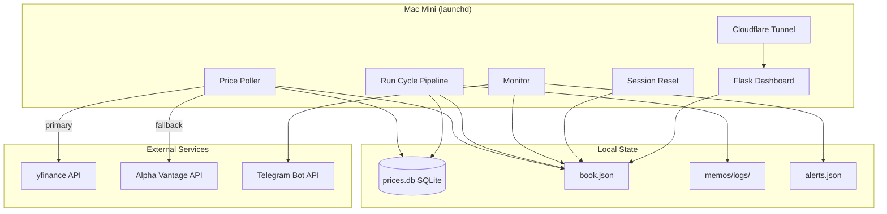
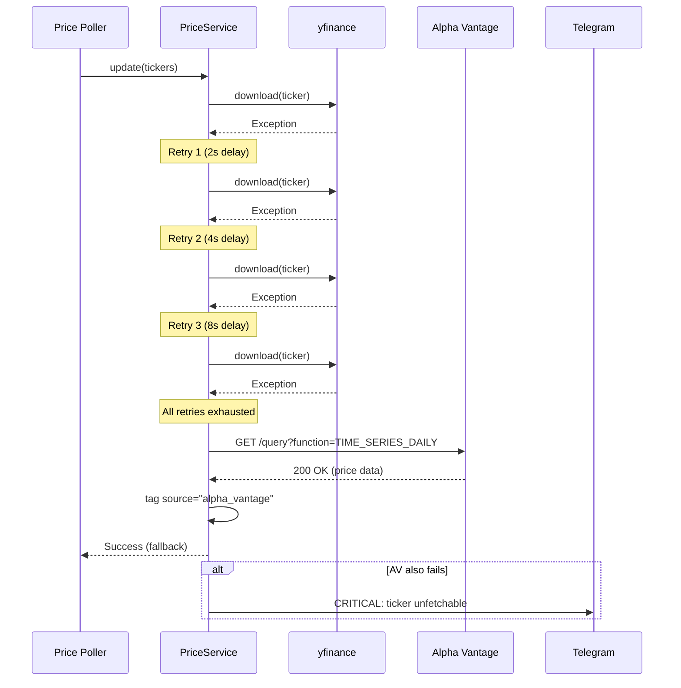
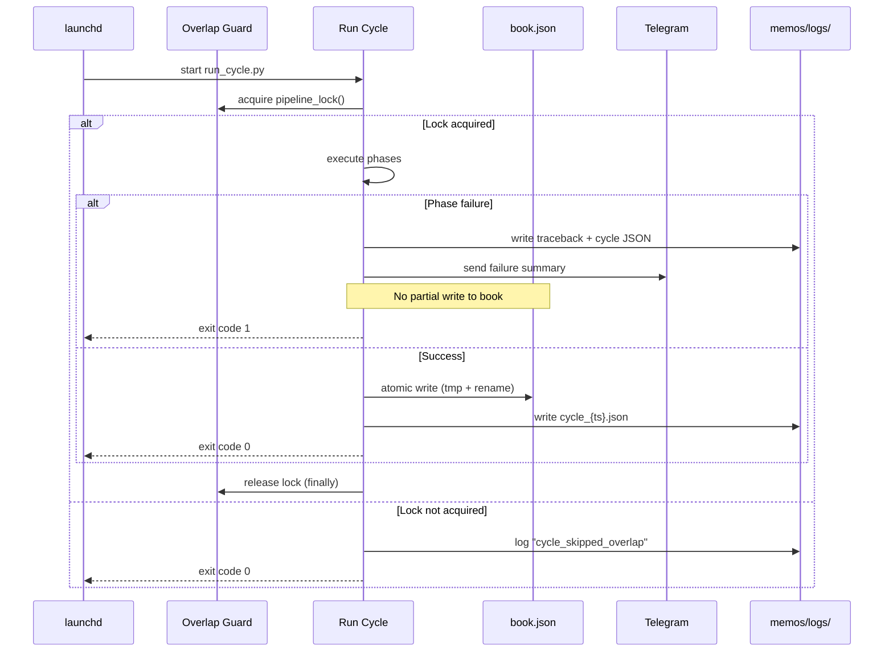

# Design Document: Operational Reliability

## Overview

This design specifies enhancements to the Agentic Trading platform's operational reliability layer — the infrastructure that keeps the system running unattended on a Mac Mini during market hours. The scope covers price data resilience (retry/backoff, fallback sources, staleness handling), pipeline execution safety (scheduling verification, failure recovery, mutual exclusion), risk monitoring (trail stops, hard stops, thesis reviews, factor betas, drawdown), system service resilience (auto-restart, health checks), and alerting (Telegram delivery pipeline, structured logging).

The design extends existing components rather than replacing them. `PriceService` gains retry and Alpha Vantage fallback logic. `monitor.py` gains factor beta computation and refined trail stop mechanics. `run_cycle.py` adopts atomic book writes and structured cycle logging. Launchd plists gain `KeepAlive` and `ThrottleInterval` directives. The Telegram module gains an undelivered-alerts persistence layer.

### Design Decisions

| Decision | Rationale |
|----------|-----------|
| Extend `PriceService` in-place rather than wrapping | Keeps call sites unchanged; retry is transparent to consumers |
| Alpha Vantage via stdlib `urllib` (no `requests`) | Zero new dependencies; matches existing `telegram_bot.py` pattern |
| Atomic book writes via `os.replace` | Already implemented in `book_ops.py`; reuse for `run_cycle.py` |
| Factor betas stored as JSON sidecar, not in book.json | Keeps book.json compact; factor data is recomputed daily |
| Structured logs as individual JSON files per cycle | Matches existing `memos/logs/` convention; easy to grep/parse |
| Rate-limit Alpha Vantage with a module-level token bucket | Simpler than external semaphore; 5 calls/min free tier is low volume |

---

## Architecture

### System Context



### Component Interaction (Retry Flow)



### Pipeline Failure Recovery Flow



---

## Components and Interfaces

### 1. PriceService Retry Layer (`src/data_platform/prices.py`)

**Changes:**
- Add `_fetch_with_retry(ticker, lookback_days)` private method wrapping `yf.download()` with exponential backoff (2, 4, 8 seconds, 3 retries max).
- Add `_fetch_alpha_vantage(ticker, start_date)` fallback fetcher using stdlib `urllib`.
- Add `_rate_limiter` module-level token bucket for Alpha Vantage (5 calls/minute).
- Modify `update()` to call `_fetch_with_retry()` then fall through to `_fetch_alpha_vantage()` on full failure.
- Add `source` column to `price_history` table (default "yfinance").

**Interface:**

```python
class PriceService:
    def update(self, tickers: list[str], lookback_days: int = 400, progress: bool = False) -> int:
        """Unchanged signature — retry + fallback is internal."""
        ...

    def _fetch_with_retry(
        self, ticker: str, start: date, max_retries: int = 3
    ) -> pd.DataFrame | None:
        """Fetch with exponential backoff. Returns DataFrame or None."""
        ...

    def _fetch_alpha_vantage(self, ticker: str, start: date) -> pd.DataFrame | None:
        """Single-attempt Alpha Vantage fetch. Returns DataFrame or None."""
        ...

    def get_fetch_status(self, ticker: str) -> str:
        """Returns 'ok', 'fetch_failed', or 'unfetchable' for a ticker."""
        ...
```

### 2. Market Calendar Staleness Gating (`src/data_platform/market_calendar.py`)

**Changes:**
- Add `is_equity_stale_check_suppressed(now)` helper returning True when market is closed (weekends + holidays).
- Add `is_fx_stale_check_suppressed(now)` helper returning True during FX session gaps (Saturday, Sunday before 17:00 ET).

**Interface:**

```python
def is_equity_stale_check_suppressed(now: datetime | None = None) -> bool:
    """True if equity staleness checks should be suppressed (market closed)."""
    ...

def is_fx_stale_check_suppressed(now: datetime | None = None) -> bool:
    """True if FX staleness checks should be suppressed (session inactive)."""
    ...
```

### 3. Pipeline Execution Logger (`src/data_platform/cycle_logger.py`)

**Changes (extend existing or create if absent):**
- `log_cycle_start(trigger_source)` → returns cycle_id (ISO timestamp)
- `log_phase_complete(cycle_id, phase_name, duration_s, outcome)`
- `log_cycle_complete(cycle_id, total_duration, proposals, trades_booked, exit_code)`
- All output as JSON to `memos/logs/cycle_{timestamp}.json`

**Interface:**

```python
def log_cycle_start(trigger_source: str = "launchd") -> str:
    """Log cycle start. Returns cycle_id for correlating subsequent entries."""
    ...

def log_phase_complete(cycle_id: str, phase: str, duration_s: float, outcome: str) -> None:
    """Append phase completion record to the cycle log file."""
    ...

def log_cycle_complete(
    cycle_id: str, total_duration_s: float, proposals: int, trades: int, exit_code: int
) -> None:
    """Finalize cycle log with summary stats."""
    ...
```

### 4. Circuit Breaker Enhancements (`src/trading/circuit_breaker.py`)

**Changes:**
- Add error handling in `reset_session_nav()` for missing/corrupt book.json — sends Telegram alert and retains previous value.
- Add `DELEVERAGE_THRESHOLD = -0.03` and `EMERGENCY_THRESHOLD = -0.04` constants.
- Add `compute_progressive_deleverage(current_nav, session_open_nav)` returning deleverage level.

**Interface:**

```python
DELEVERAGE_THRESHOLD = -0.03
EMERGENCY_THRESHOLD = -0.04

def compute_progressive_deleverage(
    current_nav: float, session_open_nav: float
) -> str | None:
    """Returns None, 'deleverage', or 'emergency' based on drawdown level."""
    ...

def reset_session_nav(book_path: Path) -> float:
    """Enhanced: handles corrupt file, sends alert, retains previous NAV."""
    ...
```

### 5. Monitor Factor Beta Module (`src/trading/factor_beta.py` — new)

**Responsibilities:**
- Compute OLS regression of position daily returns against factor series.
- Store results in `memos/state/factors.json`.
- Surface alerts when |beta| > 0.4 (warning) or |beta| > 0.6 (critical).

**Interface:**

```python
@dataclass
class FactorBetaResult:
    ticker: str
    factor_name: str
    beta: float
    r_squared: float
    trading_days_used: int
    computed_date: str

def compute_factor_betas(
    ticker: str,
    price_service: PriceService,
    factor_tickers: dict[str, str],  # {"market": "SPY", "energy": "XLE", ...}
    min_days: int = 126,
) -> list[FactorBetaResult]:
    """Compute betas for one ticker against all configured factors."""
    ...

def load_factors() -> dict:
    """Load memos/state/factors.json."""
    ...

def save_factors(factors: dict) -> None:
    """Save memos/state/factors.json atomically."""
    ...
```

### 6. Trail Stop Engine (enhanced in `monitor.py`)

**Changes:**
- Refine `compute_trail_stop_level()` to support "2.5% trailing from peak" semantics: `trail_stop = peak_price * (1 - 0.025)` for longs.
- Add monotonic ratchet enforcement: trail stop never moves against the position.
- Trigger trail stop computation when P&L first exceeds 0%.

**Interface (unchanged externally):**

```python
def compute_trail_stop_level(
    entry_price: float, peak_price: float, direction: str, method: str = "2.5%"
) -> float:
    """Compute trail stop from peak, enforcing monotonic ratchet."""
    ...
```

### 7. Telegram Alert Pipeline (`src/telegram_bot.py`)

**Changes:**
- Add `_persist_undelivered(message, error)` writing to `memos/logs/undelivered_alerts.json`.
- Add severity prefix logic: "CRITICAL:", "WARNING:", "INFO:" prefixed to messages based on a `severity` parameter.
- Modify `send_message()` signature to accept optional `severity` parameter.

**Interface:**

```python
def send_message(text: str, severity: str = "info") -> bool:
    """Enhanced: prefixes severity, persists failures to undelivered log."""
    ...
```

### 8. System Service Resilience (launchd plist changes)

**Changes to plist configurations:**
- `serve.py` plist: Add `RunAtLoad=true`, `KeepAlive=true`, `ThrottleInterval=10`.
- Cloudflare tunnel plist: Add `RunAtLoad=true`, `KeepAlive=true`.
- Add restart logging to `memos/logs/service_restarts.log` via a wrapper script or plist `ProgramArguments` chain.

### 9. Backfill Coordinator (enhancement to `PriceService`)

**Changes:**
- Add `backfill_position(ticker, entry_date)` method that checks for gaps and fills them.
- Skip weekends/holidays using `market_calendar.is_trading_day()`.
- Log backfill actions (ticker, days filled, remaining gaps).

**Interface:**

```python
def backfill_position(self, ticker: str, entry_date: date) -> dict:
    """
    Ensure continuous data from entry_date to today.
    Returns {"ticker": str, "days_backfilled": int, "gaps_remaining": int}.
    """
    ...
```

---

## Data Models

### Price History Table (extended)

```sql
CREATE TABLE IF NOT EXISTS price_history (
    ticker TEXT NOT NULL,
    date TEXT NOT NULL,
    open REAL,
    high REAL,
    low REAL,
    close REAL,
    volume INTEGER,
    source TEXT DEFAULT 'yfinance',  -- NEW: 'yfinance' | 'alpha_vantage'
    PRIMARY KEY (ticker, date)
);
```

### Cycle Log Entry (`memos/logs/cycle_{timestamp}.json`)

```json
{
  "cycle_id": "2025-07-15T09:40:00",
  "trigger_source": "launchd",
  "phases": [
    {"name": "data_refresh", "duration_s": 12.3, "outcome": "success"},
    {"name": "proposals", "duration_s": 45.1, "outcome": "success"},
    {"name": "debate", "duration_s": 90.2, "outcome": "success"},
    {"name": "risk_gate", "duration_s": 30.5, "outcome": "success"},
    {"name": "pm_decision", "duration_s": 15.0, "outcome": "success"}
  ],
  "summary": {
    "total_duration_s": 193.1,
    "proposals_generated": 4,
    "trades_booked": 1,
    "exit_code": 0
  }
}
```

### Factor Beta State (`memos/state/factors.json`)

```json
{
  "XOM": {
    "market": {"beta": 0.45, "r_squared": 0.62, "days_used": 252, "computed": "2025-07-15"},
    "energy": {"beta": 0.82, "r_squared": 0.78, "days_used": 252, "computed": "2025-07-15"}
  },
  "AAPL": {
    "market": {"beta": 1.12, "r_squared": 0.85, "days_used": 252, "computed": "2025-07-15"},
    "tech": {"beta": 0.95, "r_squared": 0.80, "days_used": 252, "computed": "2025-07-15"}
  }
}
```

### Undelivered Alerts Log (`memos/logs/undelivered_alerts.json`)

```json
[
  {
    "timestamp": "2025-07-15T09:42:00Z",
    "severity": "critical",
    "message": "CRITICAL: XOM stop breached at -3.2%, auto-closed at $108.50",
    "error": "Telegram API timeout after retry",
    "delivered": false
  }
]
```

### Fetch Status Tracking (in-memory per cycle, logged)

```python
# Within PriceService.update() — per-cycle tracking
fetch_status: dict[str, str] = {}  # ticker → "ok" | "fetch_failed" | "unfetchable"
```

### Service Restart Log (`memos/logs/service_restarts.log`)

```
2025-07-15T09:30:05 serve.py restarted (previous exit code: 1, signal: None)
2025-07-15T09:30:15 cloudflared restarted (previous exit code: 137, signal: SIGKILL)
```

---

## Correctness Properties

*A property is a characteristic or behavior that should hold true across all valid executions of a system — essentially, a formal statement about what the system should do. Properties serve as the bridge between human-readable specifications and machine-verifiable correctness guarantees.*

### Property 1: Retry Backoff Timing

*For any* sequence of transient failures from yfinance (1 to 3 failures before success or exhaustion), the cumulative wait time before the Nth attempt SHALL equal the sum of 2^i seconds for i in 1..N-1 (i.e., 2s, then 6s total, then 14s total).

**Validates: Requirements 1.1**

### Property 2: Stale Data Rejection

*For any* ticker whose most recent stored price is older than 4 hours and the market is currently open, the price SHALL be excluded from NAV computation and the ticker SHALL be marked "fetch_failed".

**Validates: Requirements 1.3**

### Property 3: Alpha Vantage Rate Limiting

*For any* sequence of N Alpha Vantage fetch attempts occurring within a 60-second window, at most 5 SHALL actually execute; the remainder SHALL be delayed until the next minute boundary.

**Validates: Requirements 2.4**

### Property 4: Weekend Staleness Suppression

*For any* datetime that falls on a Saturday, Sunday, or US market holiday, equity tickers SHALL NOT be flagged as STALE regardless of their quote age.

**Validates: Requirements 3.1, 3.2**

### Property 5: Overlap Guard Mutual Exclusion

*For any* two concurrent pipeline invocations, exactly one SHALL acquire the lock and execute, while the other SHALL exit with "cycle_skipped_overlap" and exit code 0.

**Validates: Requirements 4.3, 4.4**

### Property 6: Atomic Book Write Integrity

*For any* pipeline failure occurring at any point during execution, the book.json file SHALL either contain the complete previous state or the complete new state — never a partial write.

**Validates: Requirements 6.2**

### Property 7: Trail Stop Monotonic Ratchet

*For any* sequence of peak prices [p1, p2, ..., pN] where each pi >= p(i-1), the corresponding trail stop levels [t1, t2, ..., tN] SHALL be monotonically non-decreasing for long positions and monotonically non-increasing for short positions.

**Validates: Requirements 7.2, 7.3**

### Property 8: Hard Stop State Transition Validity

*For any* position that triggers a stop breach, the position's trim_status SHALL transition through a valid path in the state machine (untrimmed → fully_exited, or half_trimmed → fully_exited) and SHALL never reach an invalid state.

**Validates: Requirements 8.1**

### Property 9: Drawdown Progressive Thresholds

*For any* portfolio NAV and session-open NAV where drawdown is computable, the system SHALL emit exactly the alerts corresponding to the highest breached threshold: circuit breaker at -2%, deleverage at -3%, emergency at -4% — with each higher threshold implying all lower ones.

**Validates: Requirements 15.1, 15.2, 15.3**

### Property 10: Thesis Review Overdue Detection

*For any* active position whose current date exceeds its review_date and whose thesis_status is not "reviewed", the position SHALL have thesis_status set to "review_overdue" after the monitor runs.

**Validates: Requirements 9.1**

### Property 11: Factor Beta Alert Thresholds

*For any* computed factor beta value, the system SHALL emit a warning alert if and only if |beta| > 0.4, and a critical alert if and only if |beta| > 0.6.

**Validates: Requirements 10.3, 10.4**

### Property 12: Telegram Severity Prefix Invariant

*For any* alert message delivered via the Telegram notifier, the message text SHALL be prefixed with "CRITICAL:", "WARNING:", or "INFO:" matching its severity level, with no other prefix format.

**Validates: Requirements 13.4**

### Property 13: Pipeline Cycle Logging Completeness

*For any* completed pipeline cycle (success or failure), the cycle log file SHALL contain a "start" entry, one entry per executed phase, and a "summary" entry — with the total duration equaling the sum of phase durations plus overhead.

**Validates: Requirements 14.1, 14.2, 14.3**

---

## Error Handling

### Price Fetching Failures

| Scenario | Handling | Recovery |
|----------|----------|----------|
| yfinance transient error | Retry 3× with exponential backoff (2, 4, 8s) | Use Alpha Vantage fallback |
| Alpha Vantage also fails | Mark ticker "unfetchable", send CRITICAL alert | Skip ticker in NAV calc; human reviews |
| Rate limit hit (AV) | Delay in token bucket, continue when slot available | Transparent to caller |
| Quote staleness during market hours | Reject quote, mark "fetch_failed" | Do not use for mark-to-market |
| All tickers stale simultaneously | Detect data feed outage, send ONE alert | Suppress repeated alerts until recovery |

### Pipeline Failures

| Scenario | Handling | Recovery |
|----------|----------|----------|
| Unhandled exception | Top-level try/except, log traceback | Exit code 1, Telegram alert, next cycle retries |
| Partial execution | No book write (atomic pattern) | Book stays at last good state |
| Overlap (concurrent invocation) | Lock fails, log "cycle_skipped_overlap" | Exit code 0, no harm done |
| Book.json corrupt at session reset | Alert via Telegram, retain previous session_open_nav | Manual intervention |

### Risk Monitor Failures

| Scenario | Handling | Recovery |
|----------|----------|----------|
| Price unavailable for stop eval | Skip stop execution, send WARNING alert | Wait for next poll cycle |
| Factor history too short (<126 days) | Skip beta computation, log "insufficient_history" | Compute once enough data accumulates |
| Telegram delivery failure | Retry once (1s delay), persist to undelivered log | Human reviews undelivered log |

### System Service Failures

| Scenario | Handling | Recovery |
|----------|----------|----------|
| Flask dashboard crash | launchd `KeepAlive=true` restarts after 10s | Log restart to service_restarts.log |
| Cloudflare tunnel crash | launchd `KeepAlive=true` restarts immediately | External access restored on restart |
| Price poller crash mid-cycle | launchd `KeepAlive` with `ThrottleInterval` | Next cycle picks up; no corrupted state |

---

## Testing Strategy

### Unit Tests (pytest)

Focus on specific examples and edge cases:

- **Price retry**: Mock yfinance to fail N times, verify retry count and backoff timing.
- **Alpha Vantage fallback**: Mock yfinance failure + AV success, verify `source` tag.
- **Rate limiter**: Verify 6th call within 60s is delayed.
- **Market calendar**: Specific holiday dates return `is_trading_day=False`.
- **Session reset with corrupt file**: Verify alert sent and previous NAV retained.
- **Trail stop direction**: Long position stop moves up, short position stop moves down.
- **State machine transitions**: Verify valid/invalid transitions raise appropriately.
- **Telegram message splitting**: Messages > 4000 chars split on newline boundaries.
- **Cycle logger**: Verify JSON structure and file naming.

### Property-Based Tests (Hypothesis)

The project already uses Hypothesis (`.hypothesis/` directory present). Property tests will validate universal invariants:

- **Retry backoff timing**: For all retry counts 0-3, cumulative delay matches formula.
- **Staleness suppression**: For all weekend/holiday datetimes, no stale flag raised.
- **Trail stop ratchet**: For all monotonically increasing peak sequences, trail stops never decrease (long) or increase (short).
- **Drawdown thresholds**: For all NAV/session_open_nav pairs, exactly the correct threshold alert is emitted.
- **State machine validity**: For all transition sequences, only valid paths succeed.
- **Factor beta alerts**: For all beta values, correct alert level emitted.
- **Telegram prefix**: For all severity values, correct prefix applied.
- **Cycle log completeness**: For all phase sequences, log contains required entries.

**Configuration:**
- Library: Hypothesis (already in project)
- Minimum iterations: 100 per property
- Tag format: `# Feature: operational-reliability, Property N: {description}`

### Integration Tests

- **End-to-end price fetch**: Real yfinance call for SPY (1 day), verify DB insert.
- **Overlap guard**: Fork two processes, verify only one executes.
- **Pipeline cycle**: Run with `--dry-run`, verify cycle log structure.
- **Telegram delivery**: Send test message to configured chat (manual verification).
- **launchd plist loading**: Run `install_scheduler.sh` in dry-run mode, verify plist generation.
